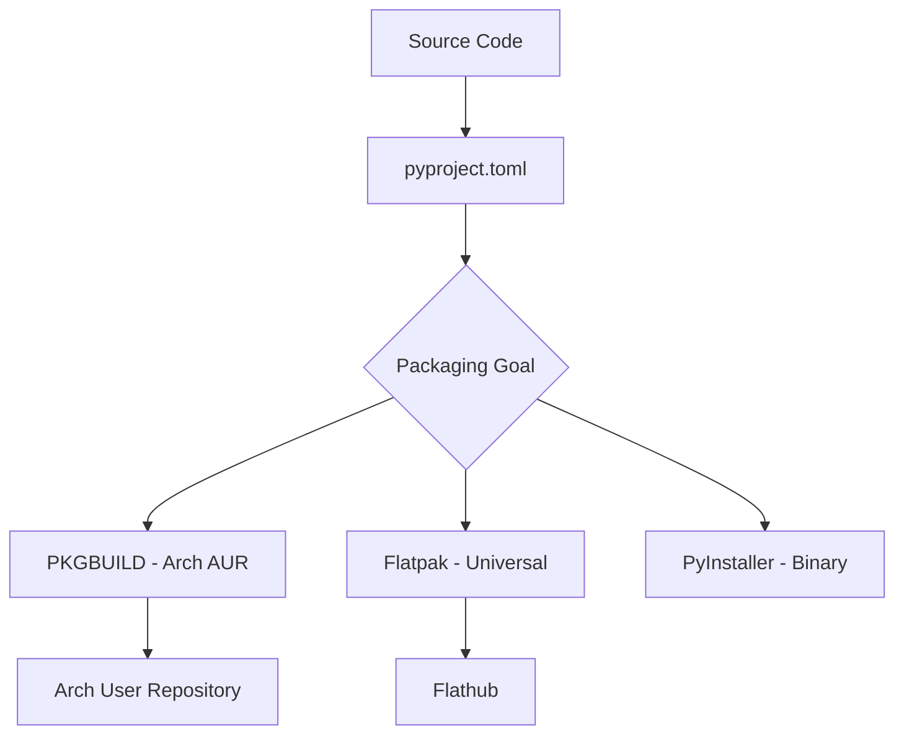

# Packaging Plan - ArchDex

ArchDex is a GTK-based Pokedex application. To package it effectively for Linux (especially Hyprland/Arch users), we will follow a tiered approach.

## Phase 1: Standardization (Foundation)
Before creating distro-specific packages, we need to standardize the Python project structure.

1.  **`pyproject.toml`**: Move from `requirements.txt` to a modern build system (like `setuptools` or `flit`). This defines metadata, dependencies, and entry points.
2.  **XDG Compliance**: Ensure the app stores its database in `~/.local/share/archdex` and config in `~/.config/archdex` instead of the project root.

## Phase 2: Native Arch Linux (PKGBUILD)
Since the name "ArchDex" and the Hyprland focus suggest an Arch Linux target, a `PKGBUILD` is the most "native" starting point.
- Uses `python-build`, `python-installer`, and `python-setuptools`.
- Handles system-level dependencies like `gtk3` and `libnotify`.

## Phase 3: Universal & Portable
1.  **Flatpak**: Best for cross-distro compatibility. Handles the complex GTK/GObject dependency chain well.
2.  **PyInstaller**: Creates a single-file executable. Good for quick sharing but can be bulky for GTK apps.

## Proposed Workflow

## Next Steps
I recommend starting with `pyproject.toml` as it makes all subsequent options easier.
